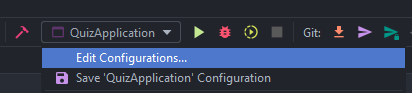

# Quiz API

API criada em Spring Boot, para ser utilizada com motivos educacionais.
Com ela pode-se criar Questões com suas respectivas alternativas e de Temas especificos.

 

## 🛠 Tecnologias

Para rodar o projeto localmente devem ser instaladas as seguintes tecnologias:

* [Docker](https://docs.docker.com/get-docker/) e [Docker Compose](https://docs.docker.com/compose/install/)
* Java 21 ou OpenJDK 21
* PostgreSQL 16 (é recomendado que seja utilizado em um container Docker)
* Intellij ou outra IDEA de sua preferência

O projeto foi criado com as seguintes tecnologias:

* Spring Boot - 3.2.3
* Spring Security - 6.0
* JWT - 4.4.0
* Hibernate
* H2 Database
* PostgreSQL
* Maven 3.9.5
* Swagger OpenAPI 2.3.0
* JUnit 
* REST Assured

> Nota: Use Postman, Insomnia ou outra ferramenta de sua preferência para testar os endpoints

## :rocket: Iniciando o projeto

Você pode abrir o terminal e clonar o projeto:

Clone o repositório via HTTPS:

    git clone https://github.com/a4s-ufpb/QuizAPI.git

## :gear: Configurando o projeto

Acesse o repositório pela sua IDE e altere o perfil `spring.profiles.active` está variável de ambiente vai estar em
`QuizAPI/src/main/resources/application.yaml` você pode usar os seguintes perfis: `test`, `dev` ou `prod`

Intellij:

Você pode atribuir valor a essas variáveis de ambiente, pela sua IDE:

Clique em Edit Configurations... selecione o QuizApplication e na parte "Environments variables" cole a seguinte config:

	APP_VERSION=V1.0.0;APP_PROFILE=test;APP_SECRET=quizapi-dev

Se você optar por usar a aplicação no perfil de Desenvolvimento `dev`, vai precisar configurar as variáveis de ambiente do Banco de Dados PostgreSQL:

PostgreSQL(dev):

    APP_VERSION=v1.0.0
    APP_PROFILE=dev
    APP_SECRET=quizapi-dev
    APP_PROFILE=dev
    DEV_USER=postgres
    DEV_PASSWORD=1234
    DEV_DB=quiz_api
    DEV_HOST=container-database-quiz
    CORS_ORIGINS=http://127.0.0.1:5500,http://localhost:3000

> NOTA: Configure suas variáveis de acordo com as configurações do Banco Postgres na sua máquina.

> NOTA: Lembre de ciar a Base de Dados com o mesmo nome que utilizar na variável `DEV_BD`.

> NOTA: Se você estiver subindo o Postgres localmente altere o valor da variável `DEV_HOST` para `localhost`.

> NOTA: Na variável `CORS_ORIGINS` estão definidas origens padrões, se quiser utilizar outra origem altere para a de sua preferência.

H2(test):

    APP_VERSION=v1.0.0
    APP_PROFILE=dev
    APP_SECRET=quizapi-dev

## :arrow_forward: Rodando o projeto

Se você não estiver utilizando Docker, basta baixar as dependências do projeto que está localizada em `QuizAPI/pom.xml`.

Para rodar a aplicação localmente, abra o terminal na raiz do projeto e utilize o seguinte comando:

    ./mvnw spring-boot:run

Abra a seguinte url `http://localhost:8080/ e acesse a API.

Se você optar por utilizar o Docker, abra o terminal na raiz do projeto e execute os seguintes comandos:
    
    mvn package -Dskiptest
    docker compose up --build

Você pode para o projeto fechando o terminal.

Abra a seguinte url `http://localhost:8080/ e acesse a API.

> NOTE: Qualquer alteração no projeto só será efetuada no container Docker se você repetir os comandos acima, onde são feitos o empacotamento do projeto gerando o arquivo `.jar`, e também build do projeto.

> Note: Pull Requests só devem ser aceitas se o projeto for capaz de construir usando Docker.

## :closed_book: Documentação

Com a API rodando, acesse a seguinte URL `http://localhost:8080/swagger-ui/index.html#/` aqui vai estar toda a documentação do projeto, informando cada endpoint, os tipos de dados suportados, e informações adicionais sobre a API.

## :page_facing_up: Licença

Este projeto utiliza a licença Apache License 2.0, [LICENSE.md](https://github.com/a4s-ufpb/LICENSE.md) para mais detalhes.

## 👩‍💻👨‍💻 Contribuidores

<table>
  <tr>
    <td align="center">
	    <a href="https://github.com/RonyAbreu">
		    
		     <b>Ronyelison Oliveira</b>
		</a> 
    </td>
  </tr>  
</table>

### Coordenadores do Projeto
<table>
	<tr>
		<td align="center">
		    <a href="https://github.com/ayladebora">
			    
		     <b>Ayla Dantas Rebouças</b>
		</a>
		 
        </td>
	</tr>
</table>

### :handshake: Quer ser um contribuidor?
Leia o arquivo [CONTRIBUTING.md](https://github.com/a4s-ufpb/EducAPI/blob/master/CONTRIBUTING.md) para saber mais detalhes, e efetue o seu Pull Request.

## :mailbox: Contatos
* Para saber mais sobre o projeto Apps4Society acesse o nosso site 
* Nos siga também no Instagram   
* Entre em contato pelo email 
---
